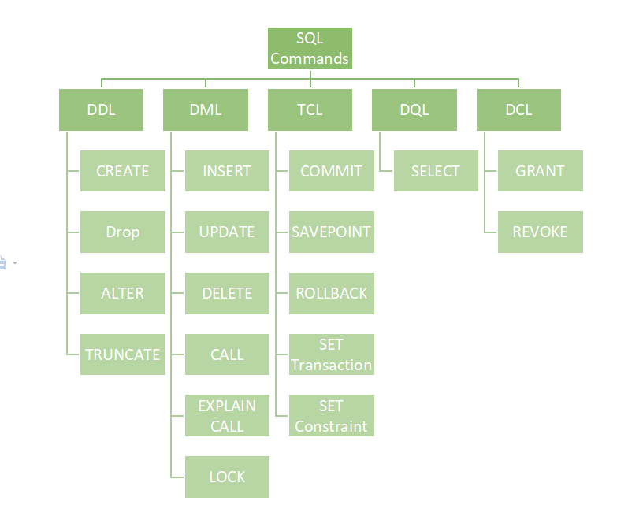

# SQL
## `Structured Query Language`  
Linguaggio standardizzato per DataBase basati sul modello relazionale (`RDBMS`)  
Convenzione di scrittura: `snake_case`

### Le 5 categorie di comandi SQL
1. **`DDL` – `Data Definition Language`**  
    permette di creare e cancellare database o di modificarne la struttura
1. **`DML` – `Data Manipulation Language`**  
    permette di inserire, cancellare, modificare i dati
1. **`TCL` – `Transaction Control Language`**  
    permette di mantenere la coerenza del database e per la **gestione delle transazioni** effettuate dai comandi DML
1. **`QL` – `Query language`**  
    permette di interrogare il database, cioè di leggere i dati.
1. **`DCL` – `Data Control Language`**  
    permette di gestire gli utenti e i permessi
- `DMCL` – `Device Media Control Language`  
    permette di controllare i supporti (memorie di massa) dove vengono memorizzati i dati. Supportato da pochi DBMS (Oralce e' uno di questi).



```sql
SELECT [ ALL | DISTINCT | TOP ] attributo/campo, attr_2
FROM tabella
[ WHERE espressione_condizionale ]
[ GROUP BY attributo [HAVING Condizione] ]
[ ORDER BY attributo ];
```
---
## DAO - Data Access Object
pattern architetturale per la gestione della persistenza:  
Fondamentalmente una classe, con relativi metodi, che rappresenta un'entità tabellare di un RDBMS, usata principalmente in applicazioni web sia di tipo Java EE sia di tipo EJB, per stratificare e isolare l'accesso ad una tabella tramite query, poste all'interno dei metodi della classe, ovvero al data layer da parte della business logic creando un maggiore livello di astrazione ed una più facile manutenibilità. I metodi del DAO con le rispettive query dentro verranno così richiamati dalle classi della business logic.

Il vantaggio relativo all'uso del DAO è dunque il mantenimento di una rigida separazione tra le componenti di un'applicazione, le quali potrebbero essere il "Modello" e il "Controllo" in un'applicazione basata sul paradigma MVC. 

---
Tip
- MariaDB è più permissivo di MySQL per via dello strict mode sulla `Group by`

---
## Piattaforme Software
- `phpMyAdmin` - applicazione web scritta in PHP
- `PgAdmin` - GUI di amministrare database di PostgreSQL.

---
## Pacchetti SW
- ### [`XAMPP`](../xampp/ReadMe.md)
    - [Recuperare DB Danneggiato su XAMPP](../xampp/xampp_Recuperare_DB_danneggiato.md)
- ### `WAMP` - `LAMP` - `MAMP`

---
---
## Switch in SQL
```sql
SELECT
  CASE  WHEN c.censored = false
        THEN c.comment
        ELSE 'censored Comment'
        END,
FROM Tabella;
```