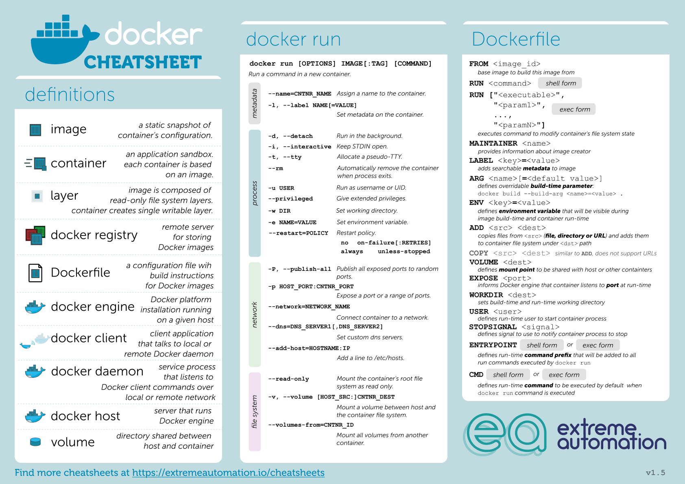

# Docker

Tecnologia per l'isolamento delle risorse  

Termini:  
- Container
    - I container sono pacchetti di software che contengono tutti gli elementi necessari per l'esecuzione in qualsiasi ambiente. In questo modo, i container virtualizzano il sistema operativo e sono eseguibili ovunque, da un data center privato al cloud pubblico o anche sul laptop di uno sviluppatore.
- Differenze tra VM e Container
- da Chroot a Kubernetes
    - Kubernetes è un sistema open-source di orchestrazione e gestione di container. Inizialmente sviluppato da Google, adesso è mantenuto da Cloud Native Computing Foundation. Funziona con molti sistemi di containerizzazione, compreso Docker.

