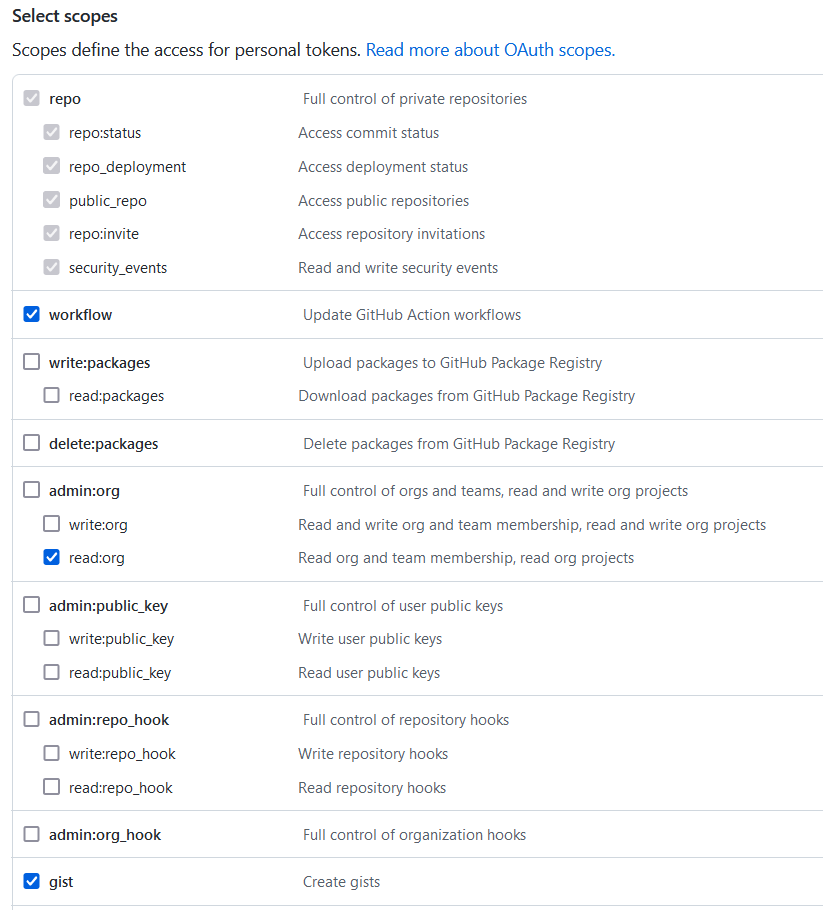

come creare un Token su GitHub
1. `setting` da icona in alto a DX
2. `Developer Settings` fondo elenco a SX
3. `Personal access tokens` fondo (3°) elenco a SX
4. `Generate new token` Pulsante
5. selezionare opzioni  
per intelliJ IDEA Il token deve avere:
   - repo      - TUTTO
   - workflow  - SI
   - admin:org  
     - write:org   NO  
     - read:org    SI
   - gits      - SI

