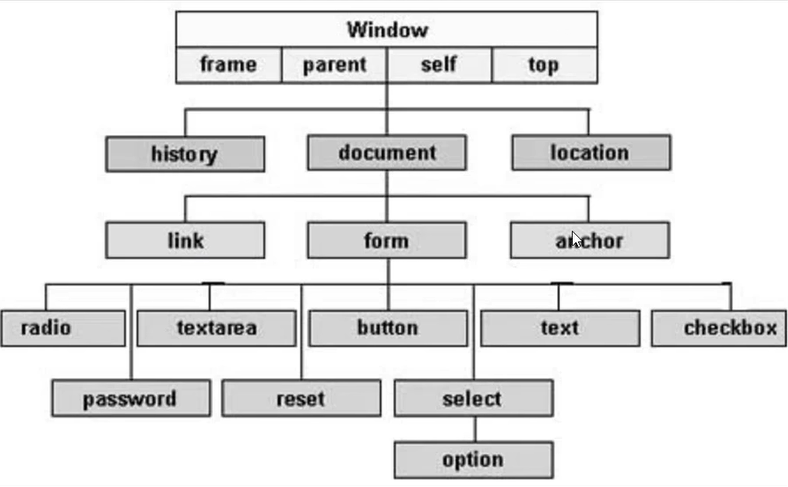

# HTML

- [URL_e _Domini](./URL_e_Domini.md)
- [Scrivere codice velocemente in VS Code](../IDE/VSCode/ShortCuts.md/#html---scrivere-codice-velocemente)
- [URL-encoding](../Termini_e_Concetti/Definizioni_e_Concetti.md/#url-encoding)
- [Appunti](./appunti.md)

---