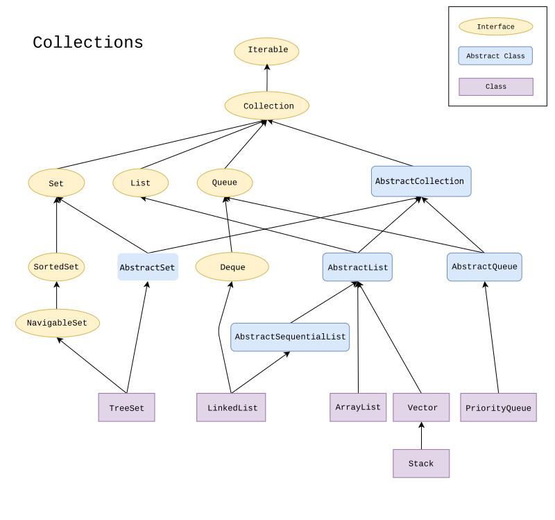

# Java Collection Framework
Sebbene indicato come un framework, funziona come una libreria. 


Buona pratica nella scelta della struttura di raggruppamento è partire dalle interfacce di alto livello che descrivono i tipi base in modo astratto, scegliendo successivamente la classe che implementa il tipo base, attraverso considerazioni che riguardano la velocità di esecuzione e il consumo di memoria. A questi aspetti ci si riferisce con i termini di **costo di tempo e di spazio** di un modulo software.

# L'interfaccia `java.util.Collection` 
metodi di uso più frequente:
```java
boolean add(E e)
boolean remove(Object o)
boolean contains(Object o)
boolean isEmpty()
void clear()
int size()
Iterator<E> iterator()
```
Per iterare gli elementi della collezione possiamo far uso di un oggetto che implementa l'interfaccia **`Iterator<E>`** attraverso l'invocazione di `iterator()`.  
L'interfaccia `Iterator` ha quattro metodi:
```java
boolean hasNext()
E next()
void remove()
```

---
## `List` - L'interfaccia `java.util.List<E>` - tipi lista
- rispetta l'**ordine d'inserimento**
- ogni elemento ha un **indice** con valore di partenza 0
### metodi per l'indicizzazione degli elementi
```java
add(int index, E element)
E get(int index)
int indexOf(Object o)
E remove(int index)
```

## `ArrayList` - Classe `java.util.ArrayList`
### implementa `List`
- identica a `Vector` ma con metodi non sincronizzati

## `Vector` - Classe `java.util.Vector`
### implementa `List`
- fornisce un'implementazione sincronizzata dei metodi di `List` risultando `Thread Safe`

## `Stack` - Classe `java.util.Stack` - Pila di piatti
### estende `Vector`
- `LIFO` (Last in first out)
- aggiunge i metodi per il supporto LIFO:
```java
push();
pop();
peek();
```
Un'alternativa più completa suggerita dalle `API Java 8` è utilizzare una classe che implementa l'interfaccia
`java.util.Deque` come `java.util.ArrayDeque<E>` al posto di `Stack`.

---
## `java.util.Queue<E>` - tipi coda

---
## `Set` - L'interfaccia `java.util.Set<E>` 
### estende `Collection`.  
- Può essere definito come una raccolta di oggetti **non ordinati** e **non ammette valori duplicati**.
- Il **confronto** tra oggetti avviene attraverso i metodi `equals()` ed `hashCode()` che ogni classe eredita dalla superclasse `Object`

## `SortedSet` - L'interfaccia `java.util.SortedSet`
### estende `Set`
- insiemi dotati anche di un **ordinamento** sugli elementi 

## `TreeSet` - Classe
### implementa `SortedSet`

---
## `Comparable` - L'interfaccia `java.lang.Comparable`
- prevede l'implementazione del solo metodo `public int compareTo(Object x);`
- ritorna:
    - un numero positivo se l'oggetto corrente è maggiore di quello passato come parametro, 
    - 0 se oggetto corrente ed oggetto passato sono uguali,
    - un numero negativo se l'oggetto corrente è più
piccolo di quello passato

---
continua da https://www.html.it/pag/62281/interfacce-list-e-queue-in-java/