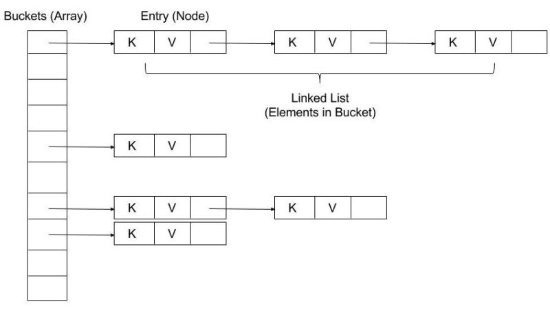

# HashMap in Java

## Funzionamento interno
https://www.linkedin.com/feed/update/urn:li:activity:7001550937282486272/

- HashMap in Java funziona sui principi di hashing. È una struttura dati che ci consente di memorizzare un oggetto e recuperarlo in tempo costante O(1) a condizione che conosciamo la chiave. 

- Gli oggetti vengono memorizzati chiamando il metodo put(key, value) e recuperati chiamando il metodo get(key).

- HashMap utilizza più liste collegate singolarmente per memorizzare gli elementi, questi sono chiamati **`bucket`**.

## `.put(key, value);`

- Quando passiamo Key and Value al metodo put(), viene chiamato il metodo hashCode() sull'oggetto Key e applica l'hashcode restituito nella sua funzione di hashing per trovare una posizione del bucket per archiviare l'oggetto Entry.

- Il punto importante da notare è che HashMap in Java memorizza sia oggetti chiave che valori.

👉Cosa succede se durante un'operazione put(key, value) due chiavi diverse restituiscono lo stesso hashcode?

- L'hashCode() sulla chiave viene utilizzato per determinare il bucket in cui verrà memorizzata la voce.

- Una volta identificato il bucket, hashCode viene utilizzato per verificare se esiste già una chiave con lo stesso hashCode o meno.

- Se non esiste una chiave con lo stesso hashCode, l'oggetto (chiave, valore) viene inserito nel bucket. 

- Se esiste una chiave esistente con lo stesso hashCode, sulla chiave viene utilizzato il metodo equals(). 

- Se equals() restituisce true, il valore viene sovrascritto, altrimenti un nuovo oggetto (chiave, valore) viene aggiunto al bucket della lista singolarmente collegata.

## `.get(key);`

- Per l'operazione get() di HashMap, anche in questo caso viene utilizzato il token hashCode per determinare il bucket in cui cercare il valore.

- Dopo aver identificato il bucket, le voci vengono attraversate per scoprire la voce con la chiave data utilizzando il metodo hashcode() e equals(). 

- Se viene trovata una corrispondenza, il valore viene restituito, altrimenti viene restituito null. 

---
https://it.wikipedia.org/wiki/Hash_table  
https://it.wikipedia.org/wiki/Funzione_di_hash