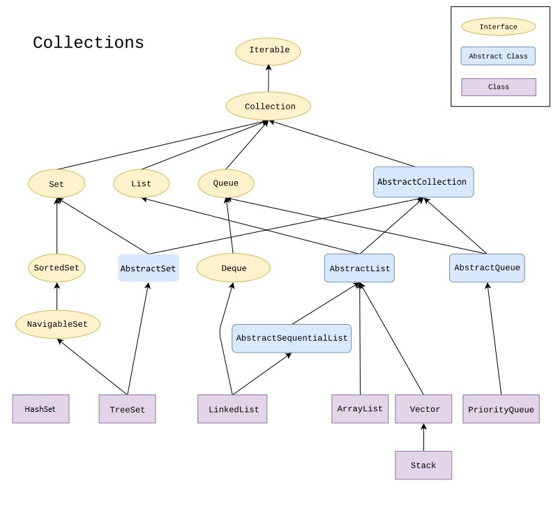

# Java Collection 



# `java.util.Collection` - Interfaccia
```java
public interface Collection<E> extends Iterable<E> {
    // ..
}
```
```java
// Metodi di uso più frequente:
boolean add(E e);
boolean remove(Object o);
boolean contains(Object o);
boolean isEmpty();
void clear();
int size();
Iterator<E> iterator();

// ed anche:
Object[] toArray();
<T> T[] toArray(T[] a);
boolean addAll(Collection<? extends E> c);
boolean removeAll(Collection<?> c);
```
Per **iterare gli elementi** della collezione possiamo far uso di un oggetto che implementa l'interfaccia **`Iterator<E>`** attraverso l'invocazione di `iterator()`.  
L'interfaccia `Iterator` ha quattro metodi:
```java
boolean hasNext()
E next()
void remove()
```

---
## `List` - Interfaccia
- `java.util.List<E>`
- rispetta l'**ordine d'inserimento**
- ogni elemento ha un **indice** con valore di partenza 0
```java
// Metodi per l'indicizzazione degli elementi
add(int index, E element)
E get(int index)
int indexOf(Object o)
E remove(int index)
```

## `ArrayList` - Classe
- `java.util.ArrayList`
```java
public class ArrayList<E> extends AbstractList<E>
    implements List<E>, RandomAccess, Cloneable, java.io.Serializable { 
            // .... 
}
// AbstractList<E> extends AbstractCollection<E> :: implements Collection<E> 
```
- identica a `Vector` ma con metodi non sincronizzati

## `Vector` - Classe
- `java.util.Vector`
- implementa `List`
- fornisce un'implementazione sincronizzata dei metodi di `List` risultando `Thread Safe`

## `Stack` - Classe - Pila di piatti
- `java.util.Stack`
- estende `Vector`
- `LIFO` (Last in first out)
```java
// Metodi aggiuntivi per il supporto LIFO
push();
pop();
peek();
```
Un'alternativa più completa suggerita dalle `API Java 8` è utilizzare una classe che implementa l'interfaccia
`java.util.Deque` come `java.util.ArrayDeque<E>` al posto di `Stack`.

---
## `Queue` - Interfaccia - Pila di piatti
- `java.util.Queue<E>` - tipi coda
- estende `Collection`
- ordinamento elem. secondo le specifiche **`FIFO`** (First in first out).
- Metodi:
```java
E element()     // ritorna elem. in testa alla coda senza rimuoverlo
// lancia una NoSuchElementException in caso di coda vuota
E peek()        // ritorna elem. in testa alla coda senza rimuoverlo
// return null in caso di coda vuota 
boolean add(E e)    // inserisce un elemento restituendo true
// lancia una IllegalStateException in caso di fallimento
boolean offer(E e) // inserisce un elemento se possibile (non violando la capacità specificata per la coda) restituendo true
E poll()    // nel caso di coda vuota restituisce null
E remove()  // nel caso di coda vuota lancia un'eccezione
```
Esempi di implementazioni di Queue sono:
## `ArrayBlockingQueue<E>`
- implementa una blocking queue con capacità specificata attraverso un costruttore della classe
- ordinan gli elementi secondo le specifiche FIFO.
- Una blocking queue è `Thread Safe`
- non accetta elementi null
- generalmente è pensata per scenari di tipo produttore-consumatore.
## `ArrayDeque<E>`
- implementa l'interfaccia `java.util.Deque` che estende Queue.
- non ha restrizioni sulle capacità e può crescere secondo le necessità. Non è `Thread Safe` e non consente elementi null. Questa classe può essere più veloce nelle operazioni della classe `Stack` quando usata come stack, e più veloce della classe `LinkedList` quando usata come queue.
## `PriorityQueue<E>`
- implementa una priority queue basata su un binary heap.
- Gli elementi sono ordinati secondo il loro ordinamento naturale o in accordo ad un comparatore fornito in input ai costruttori della classe.
- Non è limitata nella capacità
- non è `Thread Safe` (nel caso di necessità di accessi concorrenti si può utilizzare la versione sincronizzata `PriorityBlockingQueue<E>`).

---
## `Set` - Interfaccia
- `java.util.Set<E>` 
- estende `Collection`.  
- Può essere definito come tipo di dato Insieme (raccolta di oggetti)
- **non definisce un ordinamento**
- **non ammette valori duplicati**, esteso alle sue implementazioni
- **confronto** tra oggetti attraverso i metodi `equals()` ed `hashCode()` ereditati da `Object`
- necessita ridefinizione di `equals()` ed `hashCode()` nella classe derivata

## `SortedSet` - Interfaccia
- `java.util.SortedSet`
- estende `Set`
- insiemi **dotati di ordinamento** sugli elementi
- consente di definire un ordinamento sugli elementi
- **non ammette valori duplicati**

## `TreeSet` - Classe
- implementa `SortedSet`
- consente di definire un ordinamento sugli elementi
- iretando gli elementi verranno sempre restituiti secondo il criterio definito
    - la quantità di tempo richiesta da un TreeSet per compiere le operazioni base è proporzionale al logaritmo del numero dei suoi elementi.
- richiede che tutti gli elementi ad esso aggiunti implementino l'interfaccia `Comparable` per il criterio di ordinamento che verrà applicato
- In alternativa è possibile istanziare una TreeSet utilizzando i costruttori che richiedono un oggetto di una classe che implementa l'interfaccia `Comparator`

## `HashSet` - Classe
- implementa `Set`
- necessita ridefinizione di `equals()` ed `hashCode()` per implementare la logica di uguaglianza.  
In particolare il contratto previsto da equals() prevede che se per due oggetti A e B, A.equals(B) restituisca true. Allora il valore restituito da A.hashCode() deve essere ugualeal valore restituito da B.hashCode().In generale invece due oggetti possono restituire lo stesso valore attraversoil metodo hashCode() ma non essere uguali secondo equals(). Inoltre il contratto di equals() prevede che valgano le seguenti proprietà:

Proprietà |	Descrizione
-- | --
Riflessiva |	Un oggetto è uguale a sé stesso: A.equals(A) restituisce true.
Simmetrica |	Se A.equals(B) restituisce true, allora anche B.equals(A) deve restituire true.
Transitiva |	Se A.equals(B) e B.equals(C) restituiscono true, allora anche A.equals(C) deve restituire true.

Con queste regole siamo in grado di gestire correttamente oggetti che vengono aggiunti a classi che implementano Set. 

es.:
```java
// ridefinizione di equals() ed hashCode()
public class Point {
	private int x, y;
    // Costruttore, getter e setter
	public boolean equals(Object point) {
		if (point instanceof Point) {
			Point p = (Point)point;
			return (x==p.x && y==p.y) ? true : false;
		} else return false;
	}
	public int hashCode(){
		return 1;
	}
}
```
```java
// ciclare sull'insieme Set
HashSet<Point> pointsSet = new HashSet<Point>();
// codice..
for(Point point : pointsSet){
	System.out.println(point.getX()+"-"+point.getY());
}
```

---
---
## `Comparable` - Interfaccia
- `java.lang.Comparable`
- prevede l'implementazione del solo metodo
```java
public int compareTo(Object x);
```
- ritorna:
    - un numero positivo se l'oggetto corrente è maggiore di quello passato come parametro, 
    - 0 se oggetto corrente ed oggetto passato sono uguali,
    - un numero negativo se l'oggetto corrente è più
piccolo di quello passato
Es.
```java
public class Point implements Comparable<Point> {
    // ...
    @Override
    public int compareTo(Point p) {
        if(x==p.x && y==p.y) return 0;
        else if(x>p.x || y>p.y) return 1;
        else return -1;
    }
}
```

---

https://www.html.it/articoli/java-collections-framework/

https://www.geeksforgeeks.org/difference-between-next-and-hasnext-method-in-java-collections/

https://en.wikipedia.org/wiki/Java_collections_framework

le principali classi concrete che permettono di gestire al meglio le collezioni di oggetti

HashMap -> HashTable -> Load Factor (fattore di carico) = nr item/nr slot  
[link](https://www.youtube.com/watch?v=1AYnE4MdsCc)