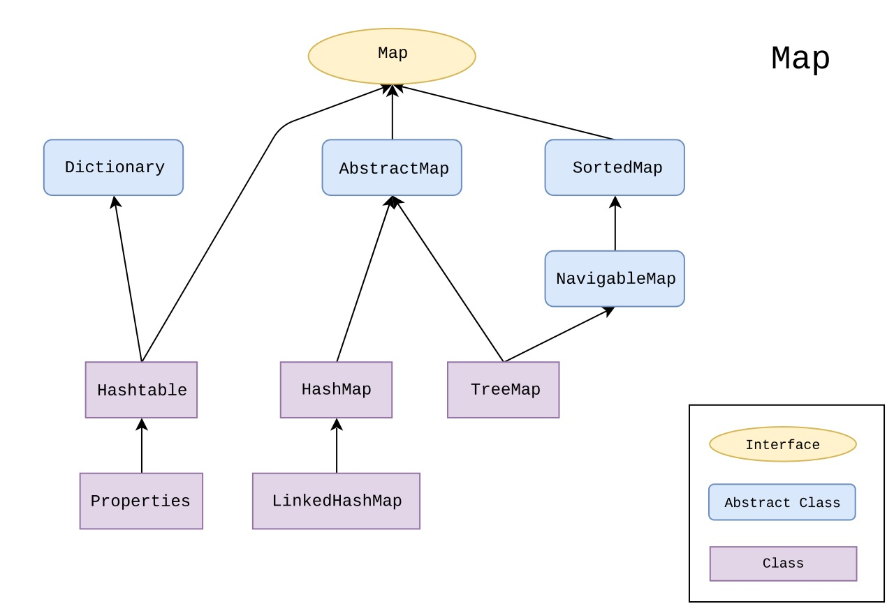

# Map


- `java.util.Map<K,V>`
- definisce la struttura dati Mappa
- **non definisce un ordinamento**
- ordinamento possibile solo a livello di chiavi, utilizzando classi che implementano l'interfaccia `java.util.SortedMap` impiegando oggetti `Comparable` o `Comparator` per definirne il criterio.
- oggetti memorizzati secondo (key, value)
- La chiave identifica univocamente un elemento in una mappa: non è possibile avere due elementi in una mappa con lo stesso valore di chiave
- il secondo elmento con medesima chiave, sovrascrive!!
- metodi più importanti esposti dall'interfaccia Map:
```java
V put(K key, V value);  // inserimento di un valore
V get(Object key);      // recupero di un elemento
boolean containsKey(Object key);  // verificare la presenza di un elemento
void clear();
Set<K> keySet();    // restituiscce insieme delle sole chiavi
Collection<V> values(); // restituisce valori presenti nella mappa
```

## HashMap
- recupero degli elementi SENZA garanzie di ordine

## TreeMap
- recupero degli elementi secondo un preciso ordine
    - Integer implementa l'interfaccia Comparable fornendo un criterio di ordinamento crescente
- Il test di uguaglianza sulle chiavi di una Map avviene attraverso l'utilizzo del metodo equals()
cosi come visto per il tipo Set

https://www.html.it/pag/62779/interfaccia-map-in-java/