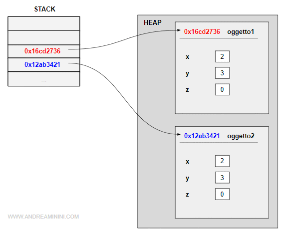

Un programma Java accede a due aree di memoria che svolgono funzioni diverse: lo stack e l'heap.

Lo **`stack`** è l'area di memoria dove sono memorizzate lo stato di esecuzione del programma, gli alias delle variabili locali di ogni metodo, il loro indirizzo di memoria e il loro valore. 

    Nota. Lo stack ha una dimensione limitata di pochi megabyte. Se viene superata si genera un errore di StackOverflowError.

Lo stack è assegnato dalla macchina virtuale Java (JVM) all'inizio dell'esecuzione del programma.  
E' una pila in modalità LIFO (Last Input First Output).  
Contiene i record di attivazione, ossia le informazioni necessarie per invocare i metodi. Ogni record di attiazione contiene i parametri, l'oggetto invocato (this), le variabili locali, il valore di ritorno, il punto di ritorno dell'invocazione di un metodo, l'istruzione successiva alla chiamata.  

    Esempio. Quando un metodo viene invocato (es. main) viene creato un record di attivazione (RDA) nello stack. Quando termina, viene rimosso dallo stack e le variabili locali del metodo sono deallocate dagli indirizzi di memoria. In questo modo tiene traccia delle chiamate nidificate di metodi che chiamano metodi.

---
L'**`heap`** è l'area di memoria dove sono memorizzati gli oggetti e il loro stato.  
E' un'area di memoria dinamica allocata al programma. Può essere modificata dalla macchina virtuale.  
Qui sono registrati gli oggetti creati con l'operatore new.
Tutta la classe con i suoi attributi (varibili), al momento dell'iniziallizzazione, vanno nello HEAP  
 
    Esempio. Al momento della creazione di un oggetto viene allocata una parte della memoria, restituito il riferimento dell'oggetto e invocato il costruttore della classe per inizializzare l'area di memoria.

Al suo interno i dati sono memorizzati in modo frammentato.  

---
### Un esempio pratico
Quando creo un nuovo oggetto, l'identificatore ossia il nome della variabile (alias) viene aggiunto nello stack insieme all'indirizzo di memoria dell'oggetto.

I dati relativi all'oggetto sono, invece, memorizzati nell'indirizzo di memoria nell'heap.  
E così via.

---
---
Nel caso di programmi con gestione automatica, invece, l’allocazione e svuotamento della memoria avviene attraverso due parti: lo stack e l’heap, cioè posizioni specifiche dove vengono allocati e deallocati oggetti. Anche se la memoria fisica per entrambe le parti è la stessa, queste funzionano diversamente: lo stack è utilizzato per le variabili di tipo valore che hanno una dimensione in byte fissa e garantisce un processo di allocazione veloce. Ogni volta che una variabile locale viene creata, questa sarà automaticamente allocata nello stack, per poi essere rimossa non appena esce dall’ambito, ovvero nel momento in cui non è più necessaria all’esecuzione del software.

L’heap invece è utilizzato per le variabili di tipo riferimento, che solitamente sono oggetti di grandi dimensioni, come ad esempio elenchi e vettori. Tali oggetti potrebbero essere troppo grandi per essere archiviati nello stack, oppure richiedono di rimanere archiviati anche quando le funzioni escono dall’ambito, e per questo motivo si tratta di un processo più lento.

Questo significa che ogni volta che si crea un nuovo oggetto con un linguaggio di programmazione, si sta eseguendo un’allocazione di heap, e molto probabilmente anche un’allocazione di stack, perché si creerà anche un riferimento a una variabile locale che poi punterà alla memoria effettiva del nuovo oggetto.

---
[fonte](https://www.andreaminini.com/java/stack-e-heap-in-java)

---
Ogni volta che dichiari una variabile all'interno di un ambito locale (un metodo) viene messa in pila.

Cioè: il tipo myVariable inserirà lo spazio per una nuova variabile su quel frame di stack dei metodi, ma non è ancora utilizzabile poiché non è inizializzato.

Quando si assegna un valore alla variabile, quel valore viene inserito nello spazio riservato nello stack.

Ora ecco la parte difficile. Se il tipo è primitivo, il valore contiene il valore assegnato. Ad esempio, int a = 55 metterà letteralmente il valore 55 in quello spazio.
Tuttavia, se il tipo non è primitivo, cioè una sottoclasse di Object, il valore inserito nello stack è in realtà un indirizzo di memoria. Questo indirizzo di memoria punta a un punto dell'heap, che è il punto in cui è archiviato l'oggetto effettivo.

L'oggetto viene inserito nell'heap durante la creazione.

---
le variabili del metodo sono archiviate in Stack. Gli oggetti, d'altra parte, sono archiviati nell'heap come mostra l'immagine qui sotto. Ecco perché se ottieni StackOverFlowException, significa che hai dichiarato troppe variabili in un metodo o stai chiamando troppi metodi in una chiamata ricorsiva. E se ricevi Java Heap Space Error, significa che stai creando più oggetti di quanti ne crei.

---
https://www.fastweb.it/fastweb-plus/digital-magazine/garbage-collector-cose-a-cosa-serve-e-come-funziona/

---
---

// quello che possiamo disegnare è uno stack (pila) i metodi / Hesp gli oggetti, i linguaggi di programmazione impilano i metodi

possiamo immaginare Lo STACK come l'ambiente di lavoro che java si crea e che riempie e toglie
lo HEAP inseriamo gli oggetti da processare