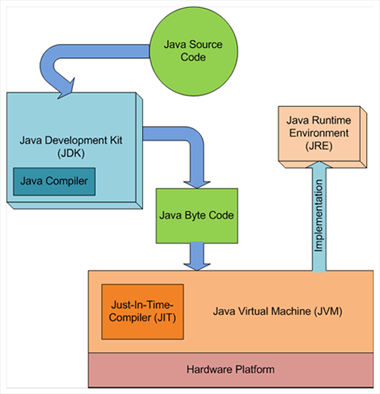
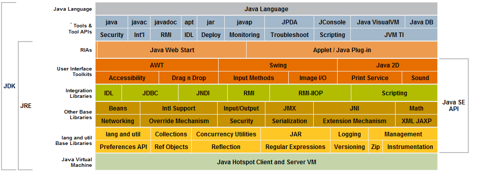

Il codice sorgente viene "compilato" dal JCC, generando una sorta di codice "intermedio" (il **ByteCode**), a sua volta interpretato dalla JVM, ed eseguito dalla JRE

---
## JCC - Java Class Compiler
- Esegue la compilazione del Codice Sorgente (Alto livello), file con estensione .java;
- genera file **ByteCode** con estensione .class
- il file ByteCode è molto più veloce da eseguire, essendo più simile ad un codice macchina

---
## JVM - Java Virtual Machine - l'Interprete
- Componente software della piattaforma Java che esegue i programmi già tradotti in ByteCode (la prima fase di compilazione)
- la JVM interagisce con l'O.S., e tramite esso con l'hardware, ciò permette l'indipendenza dalla piattaforma hardware di esecuzione
- Le prime implementazioni della JVM erano interpreti puri.  
    Nelle recenti implementazioni di JVM, per esigenze di maggiori prestazioni, è stato incorporato un **compilatore just-in-time** (**JIT compiler**), che al momento del lancio "al volo" genera codice nativo nel linguaggio macchina del computer ospite
- in alternativa, per ulteriori esigenze prestazionali, un hardware dedicato all'esecuzione in hardware del ByteCode
- è il concetto **WORA**: "Write Once, Run Anywhere" (Scrivi una volta ed esegui ovunque).  
- la virtual machine inizia l'esecuzione partendo dal metodo main

---
## JRE - Java Runtime Environment
Ambiente di esecuzione per applicazioni scritte in linguaggio Java.  
Materialmente JRE è un plugin per browser in quanto è impiegato per applicazioni web che contengono componenti scritte in Java.  
Contiene:
- la JVM
- le librerie standard (API Java)
- un launcher per le applicazioni Java

[Download JRE](https://www.java.com/it/download/manual.jsp)

##### nota per capire le versioni Java:  
##### ogni versione ha molti aggiornamenti (detti anche build) rilasciati durante il periodo di sviluppo (ad es. JRE 6 è arrivato sino all'aggiornamento 45, mentre JRE 7 all'aggiornamento 51; a maggio 2019 JRE versione 8 è in aggiornamento 211 (rilasciata il 16 aprile 2019).

---
## JDK - Java Development Kit
Insieme degli strumenti per sviluppare programmi da parte dei programmatori Java; è sempre stato l'ambiente di sviluppo più utilizzato dai programmatori Java soprattutto per applicazioni desktop.  
Include:
- il JRE
- il compilatore (java to ByteCode, **javac**)
- i tool di sviluppo
    - AppletViewer: per mostrare in anteprima il funzionamento di una applet, ovvero per l'esecuzione e il debug di un applet java senza utilizzare un browser.
    - jdb: Debugger di java
    - JConsole: Monitoraggio Java e console di gestione.
    - javadoc: utility per creare una documentazione di base a partire dai commenti inseriti nel codice sorgente.
    - jar: "Java Archive" utilizzato per gestire i file JAR, strumento a mo di zip che prepara in un unico file di tipo .jar un insieme di librerie tra di loro correlate
    - pack200: strumento di compressione Jar.
    - ed altri.. [wiki](https://it.wikipedia.org/wiki/Java_Development_Kit)

nota: Esistono diverse implementazioni, sostanzialmente:
- [AdoptOpenJDK](https://adoptopenjdk.net/)
- [IBM JDK](https://www.ibm.com/support/pages/java-sdk/)
- [OpenJDK](https://openjdk.org/)
- [Oracle JDK](https://www.oracle.com/java/technologies/downloads/)

---

---
### Java SDK - Java Software Development Kit  
Arricchisce un JDK con un IDE o application server o un DB  
approssimativamente un JDK è un sotto insieme di un SDK
Alternativo a IDE come Eclipse, ecc

---
---
## Compilator
sw che traduce un linguaggio di alto livello a basso livello, restituisce un programma oggetto, o file oggetto.
- pro esecuzione più rapida
- contro il codice può essere eseguito solo su quel tipo di macchina
## Interprete
sw che legge ed esegue immediatamente una istruzione di codice subito dopo averla tradotta, non genera un prg oggetto
- pro/contro viceversa 

## file .java
Codice Sorgente o Codice di Alto livello

## file .class
Il programma oggetto

## a terminale:
    javac nomeFile.java
        // genera nomeFile.class - il ByteCode
    java nomeFile
        // avvia programma creato

---
1. [La differenza tra Java Runtime Edition (JRE) e Java Development Kit (JDK)](https://www.appuntisoftware.it/la-differenza-tra-java-runtime-edition-jre-e-java-development-kit-jdk/) 
    ##### link esterno
3. [JVM vs JRE vs JDK: qual è la differenza?](https://www.ibm.com/cloud/blog/jvm-vs-jre-vs-jdk)

---