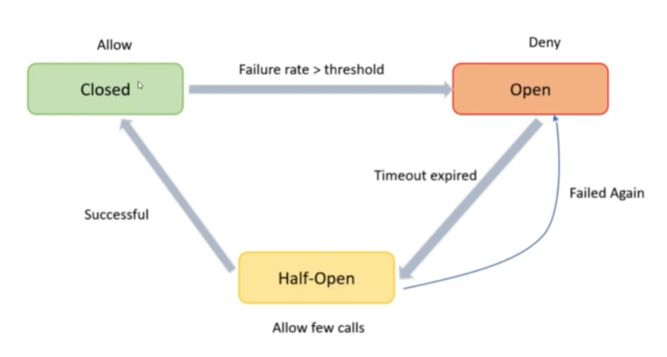

# Circuit Breaker
## Servizio della Libreria `resilience4j`

Circuit Breaker è una funzionalità particolarmente rilevante di Resilience4j in quanto permette di gestire efficacemente le situazioni di errore, evitando il rischio di sovraccarico dei servizi o di caduta del sistema. In pratica, il Circuit Breaker controlla lo stato di un servizio e, se rileva un elevato numero di errori o un tempo di risposta troppo elevato, interrompe temporaneamente le richieste verso tale servizio. Questa interruzione consente al sistema di ripristinare lo stato normale senza danneggiare ulteriormente il servizio. Quando il servizio torna disponibile, il Circuit Breaker ripristina automaticamente il flusso delle richieste. In questo modo, il Circuit Breaker garantisce la continuità del servizio anche in presenza di situazioni di errore o congestione.




### Declaration
```java
import io.github.resilience4j.circuitbreaker.annotation.CircuitBreaker;
```

## @Annotation 
```java
@CircuitBreaker(name = "a-tempo", fallbackMethod = "getPostsFallBack")
```
```ruby
@CircuitBreaker(name = "a-tempo", fallbackMethod = "getPostsFallBack")
```
```c++
@CircuitBreaker(name = "a-tempo", fallbackMethod = "getPostsFallBack")
```
- `name = "a-tempo"`  
  Nome custom assegnato nello yaml


configurazione in caso il MS chiamato non risponde o ci mette troppo tempo  
`Circuit Breaker` per verificare se il servizio è raggiungibile  
Rappresenta la chiama come se fosse un circuito
- se circuito è chiuso, il MS c'è
- se circuito è aperto, il MS è giù / sovraccarico e ci mette troppo a rispondere  
  le chiamate al MS non vengono eseguite (perche sa che è giù), si blocca prima  
  Gli si da un tempo, oltre il quale si può ricontattarlo  

Occorre implementare un metodo di fallback (metodo scappatoia)

---
per implementare `Circuit Breaker` si aggiunge dipendenza e in yaml  
## Dipendenza - File `pom.xml`
```xml
<!-- Circuit Breaker -->
		<dependency>
			<groupId>org.springframework.cloud</groupId>
			<artifactId>spring-cloud-starter-circuitbreaker-resilience4j</artifactId>
		</dependency>
```

## File `application.yaml`
```yaml
management:
  health:
    # Circuit Breaker
    circuit-breakers:
      enabled: true


resilience4j.circuitbreaker:
  instances:
    a-tempo:
      register-health-indicator: true
      # Chiusura del circuito se la request impiega più tempo di quanto stimato
      sliding-window-type: TIME_BASED
      # Numero di tentativi di request
      sliding-window-size: 1
      # Soglia - in percentuale - di fallimenti (se al 100%, basta che la chiamata al microservizio fallisca una volta sola)
      slow-call-rate-threshold: 100
      # Un'interazione è considerata lenta se impiega più di n secondi a rispondere
      slow-call-duration-threshold: 2s
      # Tempo per il quale permane lo stato HALF_OPEN
      wait-duration-in-open-state: 60s
      minimum-number-of-calls: 1
      # Numero massimo di request permesse in stato HALF_OPEN
      permitted-number-of-calls-in-half-open-state: 1
      automatic-transition-from-open-to-half-open-enabled: true
    a-tentativi:
      register-health-indicator: true
      # Chiusura del circuito se la request fallisce n volte
      sliding-window-type: COUNT_BASED
      # Numero di tentativi di request
      sliding-window-size: 1
      # Soglia - in percentuale - di fallimenti (se al 100%, basta che la chiamata al microservizio fallisca una volta sola)
      failure-rate-threshold: 100
      wait-duration-in-open-state: 60s
      permitted-number-of-calls-in-half-open-state: 3
      automatic-transition-from-open-to-half-open-enabled: true
```

### sul metodo 
```java
@CircuitBreaker(name = "a-tempo", fallbackMethod = "getPostsFallBack")
public List<PostResponse> getPosts() {
  // codice ...
  return list;
}

/** Metodo di fallback - Nel caso in cui la chiamata al MS User fallisse ( {@link #getPosts()} )
 * @param e Eccezione scaturita del metodo {@link #getPosts()}
 * @return List di Post Pubblici senza nameUser (valorizzato null) 
 */
public List<PostResponse> getPostsFallBack(Exception e){
    log.info("RESILIENCE4J: ms-user not avalaible. "+e.getMessage());
    List<PostResponse> list = postRepository.getPosts();
    return list;
}
```