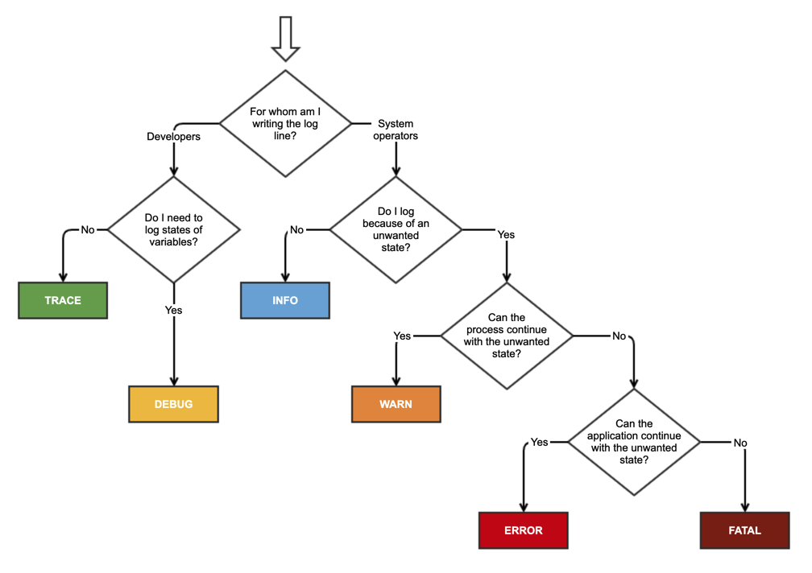

# Logging

## logging levels
ALL < TRACE < DEBUG < INFO < WARN < ERROR < FATAL < OFF

---
- https://www.section.io/engineering-education/how-to-choose-levels-of-logging/
- https://stackoverflow.com/questions/2031163/when-to-use-the-different-log-levels

