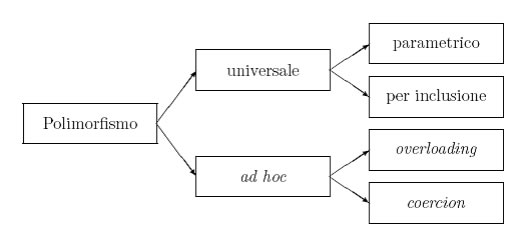

[guida OOP - html.it](https://www.html.it/guide/guida-programmazione-orientata-agli-oggetti/)

# Object-Oriented Programming
## Programmazione Orientata agli Oggetti

- **`ereditarietà`** - attributi e metodi vengono ereditate dalle Classe figlie  
- **`polimorfismo`** -  è la capacità di oggetti diversi di adattarsi ed apparire nella stessa forma in un determinato contesto; fornisce al programmatore dei mezzi per evitare di dover scrivere metodi distinti.  
approfondimento: scheda - [link web](http://www.dacrema.com/Informatica/Polimorfismo.htm)
- **`incapsulamento`** - (quando si settano a private le variabili - uso get set)  

# Gli Oggetti nella OOP

- l'oggetto si dichiara con l'operatore `new`
- l'oggetto è una istanza della Classe
- L'operatore `new` richiama il costruttore della Classe
- la Classe definisce proprietà e metodi dell'oggetto
- gli oggetti hanno stati e comportamenti
- i costruttori della Classe definiscono le proprietà dell'oggetto

---
---
### Scheda Polimorfismo
Si possono distinguere quattro tipi di polimorfismo, classificati da Cardelli e Wegner.

**coercion**: gli argomenti di una funzione o di un operatore vengono trasformati implicitamente nel tipo applicabile;

**overloading**: la stessa funzione o gli stessi operatori possono essere applicati a tipi diversi, per esempio l' operatore somma "+" può essere ultilizato per sommare interi, duole ecc…..

**parametrico**: le funzioni o gli operatori sono parametrizzati secondo il tipo a cui possono essere applicati Negli esempi riportati sopra, al posto del tipo int, double,….si può utilizzare una variabile T, che può assumere valori int, double, ecc….

**per inclusione**: un metodo che può essere applicato a tutti gli oggetti inclusi nella classe che lo ammette. (**questo tipo di polimorfismo è quello che sta alla base della programmazione orientata agli oggetti**, la programmazione ad oggetti preferisce definire la classe degli elementi su cui ha senso applicare il metodo. Una volta definita questa classe tutte le classi da essa derivate ne erediteranno i metodi).
##### sorgente: http://www.dacrema.com/Informatica/Polimorfismo.htm
---