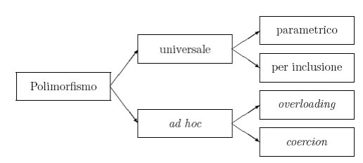

## Polimorfismo (approfondimento)
Si possono distinguere quattro tipi di polimorfismo, classificati da Cardelli e Wegner.

- **Parametrico**: le funzioni o gli operatori sono parametrizzati secondo il tipo a cui possono essere applicati. Ad esempio, al posto del tipo int, double,….si può utilizzare una variabile T, che può assumere valori int, double, ecc….

- **per `Inclusione`**: un metodo che può essere applicato a tutti gli oggetti inclusi nella classe che lo ammette. (**questo tipo di polimorfismo è quello che sta alla base della programmazione orientata agli oggetti**, la programmazione ad oggetti preferisce definire la classe degli elementi su cui ha senso applicare il metodo. Una volta definita questa classe tutte le classi da essa derivate ne erediteranno i metodi).
    ##### sorgente: http://www.dacrema.com/Informatica/Polimorfismo.htm

- **OverLoading**: la stessa funzione o gli stessi operatori possono essere applicati a tipi diversi, per esempio l' operatore somma "+" può essere ultilizato per sommare interi, duole ecc…..

- **Coercion**: gli argomenti di una funzione o di un operatore vengono trasformati implicitamente nel tipo applicabile;

---