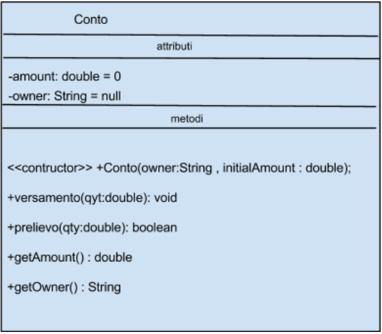

# UML

UML - diagramma delle classi (pagina 333 del libro) diagramma (disegno/schema) per descrivere una classe, indicante nome, attributi e metodi, qui si mette prima il nome è poi il tipo (contrario di ling. programm.)

UML - diagramma delle classi (pagina 333 del libro) diagramma (disegno/schema) per descrivere una classe,
    indicante nome, attributi e metodi, qui si mette prima il nome è poi il tipo (contrario di ling. programm.)
tutta la classe con i suoi attributi (variabili), al momento dell'inizializzazione, vanno nello HEAP

## Legenda:  
\- private  
\+ Public  

https://www.html.it/pag/51071/classi-oggetti-e-costruttori/