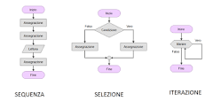

# Termini Concetti e Definizioni in Programmazione

## Case Styles:
- `camelCase`  
    usato come convenzione nella dichiarazione di variabili in molte lingue
- `PascalCase`  
    convenzione per dichiarare le classi in molte lingue
- `snake_case`  
    usato convenzionalmente per dichiarare i nomi dei campi del database
- `kebab-case`  
    utilizzato negli URL

## `Funzione Lambda` o funzione anonima
funzione definita, e possibilmente chiamata, senza essere legata ad un identificatore.  
Da usare nei casi in cui serve definire una breve funzione che ha poche linee di codice e che verrà utilizzata una sola volta (non può essere richiamata essendo priva di identificatore)  
Esempio in Js:  
1. `function(a, b) { return a + b; }`
2. `(a, b) => a + b;` *
    - \* wrappare con le graffe { } per eseguire più istruzioni

In Java le funzioni anonime sono state inserite nella versione 8 (rilasciata nel 2014)

## `serializzazione` -> persistenza del dato
**La serializzazione è il processo che rende persistente lo stato dell'oggetto**.  
Ciò significa che <u>***lo stato dell'oggetto viene convertito in un flusso di byte***</u> da utilizzare per la persistenza (ad esempio la memorizzazione di byte in un file) o il trasferimento (ad esempio l'invio di byte attraverso una rete).  
Allo stesso modo, possiamo usare la deserializzazione per riportare lo stato dell'oggetto dai byte. Questo è uno dei concetti importanti nella programmazione Java perché la serializzazione è utilizzata principalmente nella programmazione di rete.  
Gli oggetti che devono essere trasmessi attraverso la rete devono essere convertiti in byte.  
- in Java  
    A tale scopo, ogni classe o interfaccia deve implementare l'interfaccia `Serializable`. È un'interfaccia marker senza alcun metodo.
    Per impostazione predefinita, tutte le variabili dell'oggetto vengono convertite in uno **stato persistente**.  
    `transient` indica che un campo deve essere escluso dal **processo di serializzazione**.  

## `Code Smell` 
espressione usata per indicare una serie di caratteristiche che il codice sorgente può avere e che sono generalmente riconosciute come probabili indicazioni di un difetto di programmazione.

## `KISS` (principio)
acronimo usato in progettazione, che sta per `Keep It Simple, Stupid`, ossia "`rimani sul semplice, stupido`". In riferimento al codice sorgente di un programma significa non occuparsi delle ottimizzazioni fin dall'inizio, ma cercare invece di mantenere uno stile di programmazione semplice e lineare, demandando le ottimizzazioni al compilatore o a successive fasi dello sviluppo.  
Altre varianti dello stesso acronimo includono: `Keep It Sweet and Simple`, `Keep It Short and Simple` e `Keep It Simply Smart`. 
[link wiki](https://it.wikipedia.org/wiki/KISS_(principio))

## `Stack Trace`
Letteralmente "traccia dello stack", è un resoconto di tutti i metodi o le funzioni attualmente in esecuzione nel programma, a partire dal metodo che ha generato l'eccezione e risalendo fino al metodo che ha invocato il metodo che ha generato l'eccezione.  
- Viene utilizzato principalmente per il debug di un programma e viene generato automaticamente dal sistema operativo o dall'ambiente di sviluppo quando si verifica un'eccezione durante l'esecuzione del codice.  
- Fornisce una traccia dettagliata degli errori di runtime e può essere utilizzato per identificare la causa dell'errore, individuare il punto esatto del codice che ha generato l'eccezione e quindi correggere il bug.  
- Solitamente è stampato sull'output standard di errore (stderr) insieme al messaggio di errore dell'eccezione, in modo che possa essere letto dagli sviluppatori o dagli amministratori di sistema per la risoluzione dei problemi.

## `Extreme programming`
Metodologia di sviluppo del software che enfatizza la scrittura di codice di qualità e la rapidità di risposta ai cambiamenti di requisiti.  
Appartiene alla famiglia delle metodologie agili, e come tale prescrive lo sviluppo iterativo e incrementale strutturato in brevi cicli di sviluppo. Altri elementi chiave dell'XP sono il pair programming, l'uso sistematico di unit testing e refactoring, il divieto ai programmatori di sviluppare codice non strettamente necessario, l'enfasi sulla chiarezza e la semplicità del codice, la preferenza per strutture gestionali non gerarchiche, e l'importanza data alla comunicazione diretta e frequente fra sviluppatori e cliente e fra gli sviluppatori stessi.  
[link wiki](https://it.wikipedia.org/wiki/Extreme_programming)

## `ReGex` - `Regular Expression` (Espressione Regolare)
Sequenza di simboli scritta con sintassi specifica che identifica un insieme di stringhe  
[link google](https://support.google.com/a/answer/1371415?hl=it)

## `Snippet`  
frammento di codice sorgente

## `Short Code` - Tipici di WordPress  
Codici brevi o brevi sequenze di numeri, utilizzati per indirizzare i messaggi nel sistema di messaggistica multimediale e i sistemi di servizi  
Tipi:  
- Self-closing Shortcodes  
- Enclosing Shortcode  
[link su wordpress](../CMS/WordPress/ShortCode/ShortCode.md)

## Boilerplate
Codice ripetuto in molte parti di un’applicazione con poche modifiche

## `Run-time system` (o runtime system)
Software che fornisce i servizi necessari all'esecuzione di un programma, pur non facendo parte in senso stretto del sistema operativo.  
Esempi di runtime system sono:
- il **software generato dal compilatore** per la gestione dello stack
- la libreria software per la gestione della memoria (es. malloc)
- il codice che gestisce il caricamento dinamico e il linking
- il codice di debugging generato in compilazione o in esecuzione
- il codice di gestione dei thread di livello applicativo

Anche gli interpreti di codice e le macchine virtuali possono essere considerati runtime system, mentre servizi attivi in processi concorrenti sono considerati come middleware.  
[Wikipedia](https://it.wikipedia.org/wiki/Run-time_system)

## `Data Binding`
Meccanismo che consente di associare e sincronizzare una fonte dati agli elementi dell'interfaccia utente.  
In fase di design, grazie a XAML, possiamo descrivere in maniera dichiarativa le relazioni di Binding senza preoccuparci di collegare la fonte dati: senza scrivere codice procedurale ma descrivendo relazioni che legano una casella di testo con un campo di una tabella di un bd o di una sorgente dati qualunque, poi l'aggiornamento bidirezzionale avverrà in automatico

## [Costrutti di Controllo](http://www.dacrema.com/Informatica/Costrutti_controllo.htm)  
I costrutti di controllo di un linguaggio di programmazione strutturata sono quei dispositivi sintattici che permettono di combinare tra loro istruzioni elementari creando cosi istruzioni complesse o blocchi di istruzioni, controllando il flusso della loro esecuzione. I costrutti di controllo fondamentali si possono classificare in:  

- **Esecuzione in Sequenza**  
    Il modo più semplice per combinare istruzioni tra di loro consiste nell'eseguirle una dopo l'altra, in sequenza. In C, C++ e Java è possibile creare una sequenza o blocco di istruzioni semplicemente scrivendo le istruzioni una di seguito all' altra e racchiudendo questa sequenza tra parentesi graffe.
- **Costrutti Iterativi**  
    I costrutti iterativi servono per eseguire dei cicli, cioè per ripetere un determinato blocco di istruzioni in modo controllato.
    `while`, `do-while`, `for`
- **Costrutti di Selezione**  
    Costrutti di selezione in C, C++ e Java sono rappresentativi di quelli generalmente disponibili in qualsiasi linguaggio di programmazione di alto livello. Possiamo distinguere due tipi fondamentali di costrutto di selezione: 
    `if-else`, `switch`

## Algoritmo di ordinamento
giusto per citarne alcuni: Bubble sort, Heap sort, Merge sort, Quicksort, Shell sort 