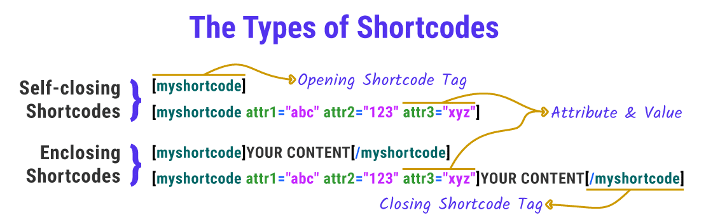
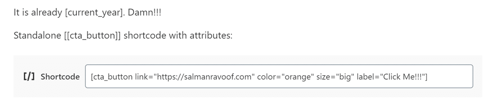
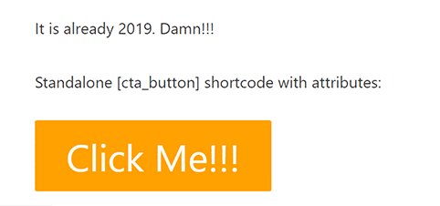
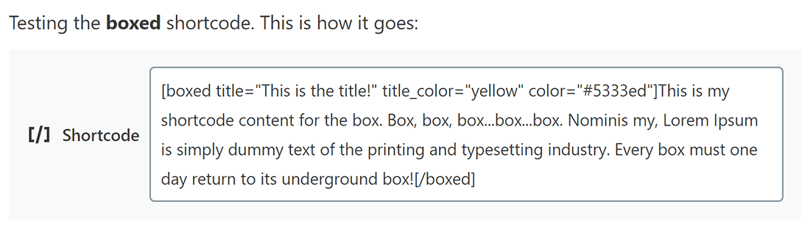
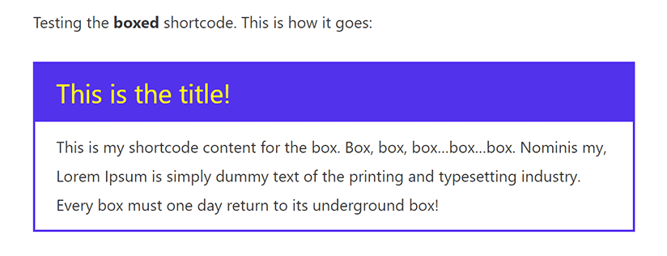

[fonte kinsta](https://kinsta.com/it/blog/shortcode-wordpress/)  
[codex.wordpress](https://codex.wordpress.org/it:API_degli_Shortcode)  

## [Tipi di Short Code](https://kinsta.com/it/blog/shortcode-wordpress/#i-2-tipi-di-shortcode):
- **Self-closing** Shortcodes  
- **Enclosing** Shortcode  



---
## [Shortcode Predefiniti di WordPress](https://kinsta.com/it/blog/shortcode-wordpress/#the-default-wordpress-shortcodes)

- **`audio`**: serve a incorporare i file audio sul vostro sito web. Include semplici controlli di riproduzione come Play & Pause. [link wordpress.org](https://wordpress.org/support/article/audio-shortcode/)
- **`caption`**: serve ad avvolgere le didascalie intorno al tuo contenuto. È usato principalmente per aggiungere didascalie di immagini, ma si può usare per qualsiasi elemento HTML. [link wordpress.org](https://codex.wordpress.org/Caption_Shortcode)
- **`embed`** : questo espande la funzione di default oEmbed e consente di impostare diversi attributi per i vostri embeddings come quella per le dimensioni massime. [link wordpress.org](https://codex.wordpress.org/Embed_Shortcode)
- **`gallery`** : serve a inserire una semplice galleria di immagini sul vostro sito. È possibile utilizzare gli attributi per definire quali immagini vengono utilizzate e personalizzare l’aspetto della galleria. [link wordpress.org](https://codex.wordpress.org/Gallery_Shortcode)
- **`playlist`** : questo self-closing shortcode visualizza una raccolta di file audio o video. Potete dargli una modalità “dark” grazie al suo attributo di stile. [link wordpress.org](https://codex.wordpress.org/Playlist_Shortcode)
- **`video`**: incorpora un file video e lo riproduce con un semplice lettore video. Questo shortcode supporta l’incorporazione di video nei formati mp4, webm, m4v, webm, ogv, wmv, flv. [link wordpress.org](https://codex.wordpress.org/Video_Shortcode)

---
## Come richiamare un SchortCode:

- in un file PHP
  ### La funzione di callback [do_shortcode()](https://developer.wordpress.org/reference/functions/do_shortcode/)  
```PHP
<?php echo do_shortcode("[name_of_your_shortcode]"); ?>
```
#####  utilizzare la funzione di richiamo do_shortcode() per attivare gli shortcode in qualsiasi punto di WordPress

- in HTML
- nell’editor di Gutenberg, nella sezione Widget, nel blocco omonimo Shortcode
- ecc..
```HTML
[name_of_your_shortcode]
```

In questo modo l’output dello shortcode apparirà nel punto in cui è inserito il codice


---
## [Shortcode API](https://codex.wordpress.org/Shortcode_API) di WordPress  
definisce in che modo è possibile utilizzare gli shortcode per personalizzare ed espandere le funzionalità del sito

---
## La funzione [add_shortcode()](https://developer.wordpress.org/reference/functions/add_shortcode/)  
- ### registra uno shortcode in WordPress
```PHP
add_shortcode( 'shortcode_name', 'shortcode_handler_function' );
```
- **`shortcode_name`**: tag che WordPress cercherà durante l’analisi del contenuto dei messaggi.  
  La Shortcode API consiglia di utilizzare solo lettere minuscole, numeri e sottolineature per definirne il valore (evitare i trattini).
- **`shortcode_handler_function`: funzione di callback**.  
  Verrà eseguita dopo che WordPress conferma la presenza di uno shortcode registrato.  

*Da porre*:
- nel file functions.php del tema child, potete eseguire la funzione add_shortcode() così com’è.  
  oppure
- nel plugin, inizializzarlo solo dopo che WordPress si è caricato completamente, avvolgendo la funzione add_shortcode() all’interno di un’altra funzione detta wrapper (hook [`init`](https://developer.wordpress.org/reference/hooks/init/)):
```PHP
function shortcodes_init(){
  add_shortcode( 'shortcode_name', 'shortcode_handler_function' );
}
add_action('init', 'shortcodes_init');
```

---
## La funzione di gestione degli shortcode  
### **funzione handler di Callback**  
nome scelto dal programmatore, richiamata dal 2° param di add_shortcode()  
```PHP
function shortcode_handler_function( $atts, $content, $tag ){ }
```

- **`$atts`**: un array associativo di attributi.  
  Opzionale, default -> stringa vuota.
- **`$content`**: il contenuto allegato, se state definendo uno shortcode di tipo enclosing. È responsabilità della funzione [handler](https://developer.wordpress.org/plugins/security/securing-output/) garantire che il valore di $content venga restituito nell’output.
- **`$tag`**: il valore del tag shortcode (shortcode_name nell’esempio precedente). Se due o più shortcode condividono la stessa funzione callback (che è valida), il valore $tag vi aiuterà a determinare quale shortcode ha attivato la funzione handler.  
- 
L’API analizza il tag dello shortcode, gli attributi e il contenuto allegato (se presente) bypassando i valori alla funzione handler, che li elabora e restituisce una stringa di output.

---
---
## Tips.  
le **doppie parentesi quadre** [[SchortCode]] cosiddette **escaping shortcode**.  
permettono di emettere qualsiasi shortcode registrato nel sito come se fosse testo normale  
Es. il nome dello schortcode [SchortCode] viene mostrato così

---
---
## Es. 1  
### Creare un plugin con uno shortcode che riporta l’anno corrente sul sito web  
- Tipo di SchortCode: **self-closing**  
> -- Passo 1 --  
> Nel file plugin.php  
> registrazione dello shortcode e definizione della sua funzione di handler
> 
```PHP
<?PHP
/*
  Plugin Name: Plugin Anno Corrente
  ...
*/

/**
 * [current_year] returns the Current Year as a 4-digit string.
 * @return string Current Year
*/

add_shortcode( 'current_year', 'salcodes_year' );
  // @par1 NomeSchortCode - @par2 funzione handler di Callback
function salcodes_init(){   // funzione wrapper 
  function salcodes_year() {  // funzione handler 
    return getdate()['year']; // funzione PHP che restituisce un array di informazioni sulla data del timestamp corrente. La chiave relativa all’anno contiene il valore dell’anno in corso (come stringa a 4 cifre). Quindi, getdate()[‘anno’] restituisce l’anno in corso
  }
}
add_action('init', 'salcodes_init');
?>
```
non è necessario passargli alcun valore variabile come $attributes, $content o $tag  
> -- Passo 2 --  
Aggiungete lo shortcode in qualsiasi punto del sito
  - a. [current_year]  
  - b. \<?php echo do_shortcode("[current_year]"); ?>

---
---
## Es. 2  
### Shortcode per un Pulsante di Call-To-Action  
- Tipo di SchortCode: **self-closing**  
- Uso del 1° param $atts della funzione handler di Callback  

in grado di personalizzare le dimensioni e il colore del pulsante CTA con gli attributi dello shortcode  
utilizzare gli attributi id e class per cambiare lo stile del pulsante (selettori CSS)  
non è necessario passargli alcun valore variabile come $attributes, $content o $tag  
> -- Passo 1 --  
> Nel file plugin.php  
> registrazione dello shortcode e definizione della sua funzione di handler

```PHP
<?PHP
/*
  Plugin Name: Plugin Pulsante personalizzabile con CSS
  ...
*/

/**
 * [cta_button] returns the HTML code for a CTA Button.
 * @return string Button HTML Code
*/

add_shortcode( 'cta_button', 'salcodes_cta' );
  // @par1 NomeSchortCode - @par2 funzione handler di Callback
function pulsante_init(){   // funzione wrapper 
  function salcodes_cta( $atts ) {  // funzione handler 
    $a = shortcode_atts( array(   // funzione WordPress: combina gli attributi shortcode dell’utente con gli attributi noti
      'link' => '#',
      'id' => 'salcodes',
      'color' => 'blue',
      'size' => '',
      'label' => 'Button',
      'target' => '_self'
      ), $atts );
    $output = '<p><a href="' . esc_url( $a['link'] ) 
      . '" id="' . esc_attr( $a['id'] ) 
      . '" class="button ' . esc_attr( $a['color'] ) 
        . ' ' . esc_attr( $a['size'] ) 
      . '" target="' . esc_attr($a['target']) . '">' 
      . esc_attr( $a['label'] ) . '</a></p>';
    return $output;
  }
}
add_action('init', 'pulsante_init');

?>
```

> -- Passo 2 --  
> foglio di stile
```PHP
/** Accodamento del foglio di stile per il pulsante  */

function salcodes_enqueue_scripts() {
  global $post;
  if( is_a( $post, 'WP_Post' ) // is_a(): verifica se $post è un’istanza dell’oggetto WP_Post. Si riferisce a tutti i tipi di post in WordPress
    && has_shortcode( $post->post_content, 'cta_button') ) // has_shortcode(): verifica se il contenuto del messaggio contiene lo shortcode [cta_button].
  {
    wp_register_style( 'salcodes-stylesheet',  
      plugin_dir_url( __FILE__ ) . 'css/style.css' ); // la funzione registra il foglio di stile style.css incluso nella cartella CSS
    wp_enqueue_style( 'salcodes-stylesheet' ); // la funzione accoda il foglio di stile style.css
  }
}
add_action( 'wp_enqueue_scripts', 'salcodes_enqueue_scripts');
```

> -- Passo 3 --  
> Personalizzazione con parametri allo SchortCode:

  
```HTML
[cta_button link="http://google.it" color="orange" size="big" label="Click Me!!"]
```

l’output:  



---
---
## Es. 3  
### shortcode enclosing chiamato [boxed] Che Usa $content
- Tipo di SchortCode: **enclosing**  

visualizza qualsiasi contenuto incluso fra i suoi tag in un box con titoli colorati

> -- Passo 1 --  
> Nel file plugin.php  
> registrazione dello shortcode e definizione della sua funzione di handler
```PHP
<?PHP
/*
  Plugin Name: Plugin enclosing chiamato [boxed]
  ...
*/

/**
 * [boxed] restituisce codice HTML per il contenuto di una box con titoli colorati
 * @return string HTML code for boxed content
*/

add_shortcode( 'boxed', 'salcodes_boxed' );

function salcodes_boxed( $atts, $content = null, $tag = '' ) {
  // $content = null : registra lo shortcode come tipo di allegato. Utilizzare la variabile $content all’interno della funzione handler per modificare l’output come desiderate
  // $tag = ”’ : definisce la variabile $tag dello shortcode. Non è necessario in questo esempio, ma è comunque una buona pratica includerlo
  $a = shortcode_atts( array(
    'title' => 'Title',
    'title_color' => 'white',
    'color' => 'blue',
    ), $atts );
  
  $output = '<div class="salcodes-boxed" style="border:2px solid ' . esc_attr( $a['color'] ) . ';">'
  .'<div class="salcodes-boxed-title" style="background-color:' . esc_attr( $a['color'] ) . ';"><h3 style="color:' . esc_attr( $a['title_color'] ) . ';">' . esc_attr( $a['title'] ) . '</h3></div>'.'<div class="salcodes-boxed-content"><p>' . esc_attr( $content ) . '</p></div>'.'</div>';
  
  return $output;
}
?>
```

> -- Passo 2 --  
> **aggiorniamo** la funzione salcodes_enqueue_scripts()  
> in quanto due shortcode usano lo stesso foglio di stile, occorre fare in modo di caricarlo anche se uno solo dei due viene usato
```PHP
/** Accodamento del foglio di stile per Salcodes */

function salcodes_enqueue_scripts() {
  global $post;
  $has_shortcode = has_shortcode( $post->post_content, 'cta_button' ) || has_shortcode( $post->post_content, 'boxed' );
  // $has_shortcode: una variabile definita dall’utente che controlla se uno dei due shortcode esiste sulla pagina/post.
  if( is_a( $post, 'WP_Post' ) && $has_shortcode ) {
    wp_register_style( 'salcodes-stylesheet',  plugin_dir_url( __FILE__ ) . 'css/style.css' );
    wp_enqueue_style( 'salcodes-stylesheet' );
  }
}
add_action( 'wp_enqueue_scripts', 'salcodes_enqueue_scripts');
```

> -- Passo 3 --  
> Personalizzazione con parametri allo SchortCode:


l’output :  
