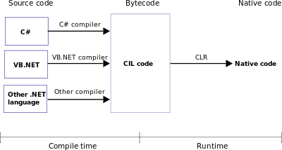

# .NET

- [Glossario .NET](https://learn.microsoft.com/it-it/dotnet/standard/glossary)
- [Che cos'è .NET?](https://learn.microsoft.com/it-it/dotnet/core/introduction)  
    - [link wiki .NET](https://it.wikipedia.org/wiki/.NET)  
    - [link wiki .NET_Framework](https://it.wikipedia.org/wiki/.NET_Framework)  
- .NET è un framework software gratuito e open source per i sistemi operativi Microsoft Windows, MacOS e Linux. È costituito da:
    - `CoreCLR`, un'implementazione runtime completa di CLR,
    - la `macchina virtuale` che gestisce l'esecuzione di programmi .NET.
    CoreCLR viene fornito con un compilatore just-in-time ottimizzato, chiamato RyuJIT.  

- Le app .NET (scritte in un linguaggio di alto livello come C#) vengono compilate in un linguaggio intermedio (IL). `IL` è un formato di codice compatto che può essere supportato in qualsiasi sistema operativo o architettura.

- `CLR` (`Common Language Runtime`)  
    l'**ambiente di esecuzione** del CLI (macchina virtuale e librerie standard della piattaforma .NET)  
      
    Schema del CLR come convertitore del Common Intermediate Language (CIL) in codice nativo
- `CLS` (`Common Language Specification`), "specifica del linguaggio comune", descrive un sottoinsieme della CLR che i compilatori devono supportare per permettere l'interoperabilità tra i diversi linguaggi di programmazione.  
    - `Mono` piattaforma di sviluppo (è una implementazione multi-piattaforma del CLS), seppur ancora incompleto, per sistemi Unix e Linux

- `CIL` (`Common Intermediate Language`)  
    è il linguaggio di programmazione di livello più basso previsto dalla piattaforma .NET e dal `Common Language Infrastructure`.  
    (un compilatore traduce il codice sorgente in istruzioni `IL`, che quindi risulta avere lo stesso ruolo che il bytecode ha nel mondo Java.)  
    Il CIL è un linguaggio assembly orientato agli oggetti, ed è completamente basato su stack. Esso viene poi compilato in codice macchina al volo da un Jit (compilatore just-in-time) e poi eseguito; questo avviene al primo avvio del programma, dopodiché la piattaforma .Net immagazzinerà l'eseguibile già compilato in una cartella apposita per velocizzare i futuri avvii.  
    CIL supporta l'orientazione agli oggetti, i tipi primitivi dotati di metodi, l'istanziamento di array e oggetti con poche istruzioni e il supporto all'uso delle costanti che l'assembly x86 non supporta, come gli oggetti, le stringhe e altri tipi primitivi. 

---
[Download .NET](https://dotnet.microsoft.com/en-us/download)